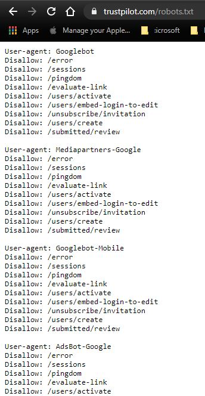
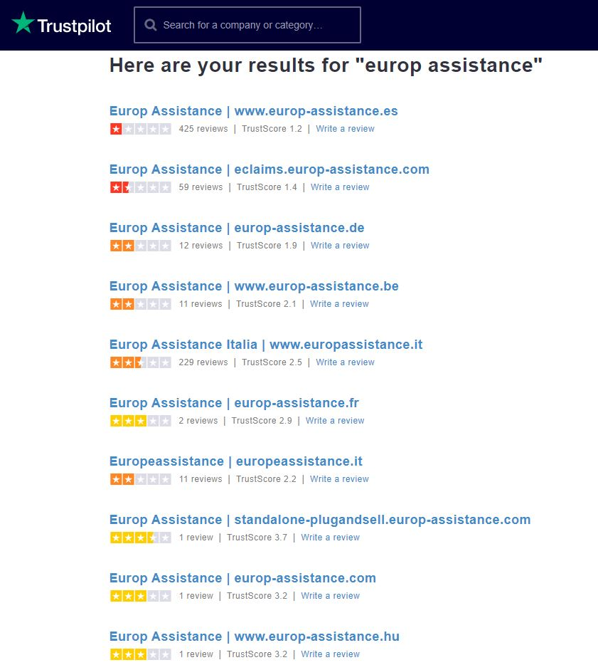
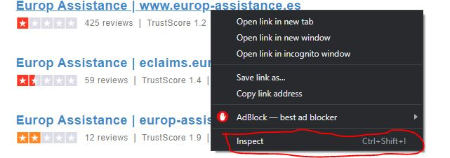
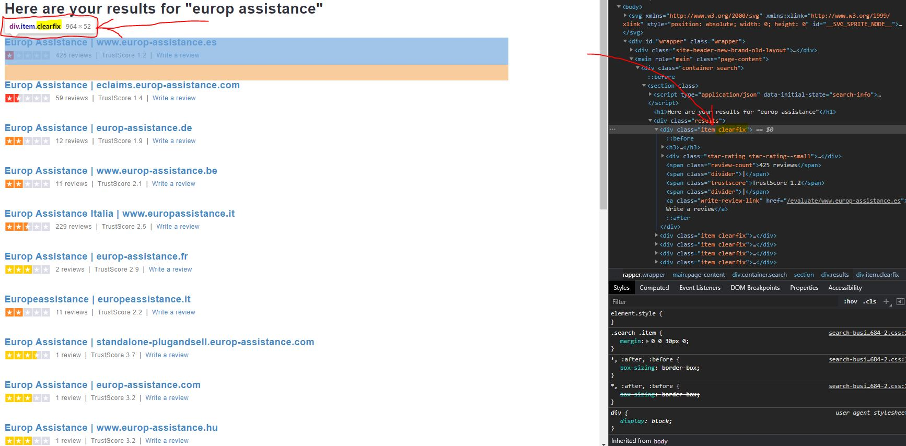

```{r knitr_init, echo = FALSE, results = "asis", cache = FALSE}
library(knitr)
library(rmdformats)

## Global options
options(max.print = "75")
opts_chunk$set(echo    = TRUE,
               cache   = FALSE,
               prompt  = FALSE,
               tidy    = FALSE,
               comment = NA,
               message = FALSE,
               warning = FALSE)
opts_knit$set(width = 75)
```

# Introduction

In this session we will take a look at web-scraping in R and Python.

We will perform 2 actions in this lunch and learn :

1. Scrape Europ-Assistance reviews from [**Trustpilot**](https://www.trustpilot.com/)
2. Control Chrome to automatically badge for us (on eTemptations)

## Europ-Assistance Reviews

Trustpilot has become a popular website for customers to review businesses and services. In this short tutorial, you'll learn how to scrape useful information off this website and generate some basic insights from it with the help of R.

On Trustpilot a review consists of a short description of the service, a 5-star rating, a user name and the time the post was made.

More specifically, we will cover the following:

1. Can I legally scrape the website?
2. Then we will look at how you can scrape Trustpilot to gather reviews
3. Then, you'll see some basic techniques to extract information off of one page: you'll extract the review text, rating, name of the author and time of submission of all the reviews on a sub-page
4. With these tools at hand, you're ready to step up your game and analyse the reviews.

## Automatically badging

At holding level, we need to badge in on a daily basis to record that we have been working (no badge = no pay). This can become quite annoying, so in order to make things easier, we will write a small script that will allow us to automatically peform this task on a daily basis.

```{r fig.show = "hold", out.width = "50%", fig.align = "center", echo = FALSE}
knitr::include_graphics("dsLogo.png")
```

# Setup Code and Load Data

First, you will need to load all the libraries for this task.

```{r}
options(scipen = 999)
if(!require("pacman")) install.packages("pacman")
pacman::p_load(tidyverse, tidytext, tm, topicmodels, magrittr, jtools, gridExtra, knitr, widyr, ggraph, igraph, kableExtra, urltools,lubridate, rebus, rvest, stringr, forcats, cld2, translate)
if(!require("devtools")) install.packages("devtools")
devtools::install_github("56north/happyorsad")
library(happyorsad)

my_theme <- function() {
  theme_apa(legend.pos   = "none") +
  theme(panel.background = element_rect(fill = "gray96", colour = "gray96"),
        plot.background  = element_rect(fill = "gray96", colour = "gray96"),
        plot.margin      = margin(1, 1, 1, 1, "cm"),
        panel.border     = element_blank(),        # facet border
        strip.background = element_blank())        # facet title background
}
```

# Webscraping EA Reviews {.tabset .tabset-fade}

In this section we will scrape and analyse some EA reviews.

## LEGAL NOTICE!!! {.tabset .tabset-fade}

### Disclaimer

**Please note that this tutorial is for demonstration purposes ONLY!**

Any form of web-scraping **MUST** be approved by your manager, which needs to be approved by a legal department.

### Is it legal?

It is very important to validate whether or not it is possible to scrape a certain website. Sometimes it is really easy to confirm whether we can or cannot scrape a website.

The easiest way to **CONFIRM** scraping is by referring to the websites's **robots.txt** file. This is an instruction manual for bots that attempt to scrape the website. **NOTE** this is NOT a legal document, but merely instructions. Hence if the instructions says "yes you can scrape" then we know that it is completely legal to scrape the website. If the instructions says "no you cannot scrape" then it doesn't legally mean we cannot.

To access the **robots.txt** file, simply go to the website's main page and type `/robots.txt` at the end. For example :

`https://www.trustpilot.com/robots.txt`

This is what we see :

```{r fig.show = "hold", out.width = "50%", fig.align = "center", echo = FALSE}

```

If this looks a bit messy don't worry, basically we have the following instructions :

```{r fig.show = "hold", out.width = "100%", fig.align = "center", echo = FALSE}
knitr::include_graphics("robotsExample.JPG")
```

Looking a bit further down, we can find that the Trustpilot website blocks all access for default bots. For more information on the robots.txt file, please refer to [this link](https://varvy.com/robottxt.html)

As mentioned before, the **robots.txt** will only make your life easy, if it allows access, it means that you don't need to search any further and you can go ahead and do what you would like to do. Since we aren't as lucky, we will need to take a look at Trustpilot's T&C's and find out if they have worded anything related to scraping/web-automation or anything such as that.

After reviewing their [T&C's](https://legal.trustpilot.com/for-reviewers/end-user-terms-and-conditions) it wasn't clear that there are any restrictions on webscraping, please note that website's T&C's can update over time (as well as the robot.txt file) - so please review these on a regular basis. 

Additionally, there are multiple tutorial's online using Trustpilot as an example on how to perform scraping, please see the following for reference :

1. [DataCamp](https://www.datacamp.com/community/tutorials/r-web-scraping-rvest)
2. [Octoparser](https://helpcenter.octoparse.com/hc/en-us/articles/360028185851-Scrape-reviews-from-Trustpilot)
3. [GitHub Repo](https://github.com/hakimkhalafi/trustpilot-scraper)
4. [Redit](https://www.reddit.com/r/datascience/comments/82my1i/scraping_and_fraud_analysing_trustpilot_reviews/)
5. [webscraper.io](https://forum.webscraper.io/t/trustpilot-scrape-not-working/3367)

## Find All Pages

First, on TrustPilot we need to find all the countries where we have reviews as each country has a different link :

```{r fig.show = "hold", out.width = "50%", fig.align = "center", echo = FALSE}

```

This page has this link [https://www.trustpilot.com/search?query=europ%20assistance](https://www.trustpilot.com/search?query=europ%20assistance). We can extract this HTML in R using the `rvest` package.

```{r}
url <- 'https://www.trustpilot.com/search?query=europ%20assistance'

urlRes <- url %>% 
  read_html() %>% 
  rvest::html_nodes('.clearfix') %>%
  rvest::html_text()
urlRes
```
As you can see this yields the different webpages that we want to scrape, but it is a bit messy. We will see a bit later how to deal with this sort of data.

### Finding Nodes

How did I know to find the `.clearfix` node? Well this is where you will need to know just a little bit of HTML. We will not go into too much detail, but essentially pressing **ctrl + shift + i** (using Chrome) will open up the HTML of the website. Alternatively you can also right click on any place of a website and search for something like *inspect element* :

```{r fig.show = "hold", out.width = "50%", fig.align = "center", echo = FALSE}

```

And this will open a window like this :
g
```{r fig.show = "hold", out.width = "50%", fig.align = "center", echo = FALSE}

```

In here if you hover your mouse over parts of the HTML, then parts of the page will be highlighted (as seen above). This will also identify the elements of the web-page and you can then extract those parts of the web-page. As you can see the `.clearfix` is the part(s) of the page we want.

### Cleaning the Result

If we just take a look at the first element of the vector we will see a structure:

```{r}
urlRes[1]
```

Here we can see that the data is separated by a `\n` character, so let's see what we can do if we split the data accordingly.

```{r}
urlRes[1] %>% str_split(pattern = "\n") %>% unlist() %>% gsub(pattern = "\\s\\s", replacement = "")
```

Clearly this looks a lot more structured, we can see 3 elements that we want :

1. The website
2. The number of reviews
3. The average score

Let's only get those for all websites.

```{r}
allSites <- NULL
for (ii in 1:length(urlRes)) {
  tmpRes <- urlRes[ii] %>% str_split(pattern = "\n") %>% unlist() %>% gsub(pattern = "\\s\\s", replacement = "") %>% .[c(3, 8, 10)] %>% as.data.frame()
  if (ii == 1) {
    allSites <- tmpRes
  } else {
    allSites <- cbind(allSites, tmpRes)
  }
}

allSites <- allSites %>% t() %>% as_tibble()
names(allSites) <- c("website", "review", "score")
allSites
```

Looking good! Now let's just get clear this up a little bit more.

```{r}
allSites <- allSites %>% 
  mutate(website = website %>% gsub(pattern = "(.*) | (.*)", replacement = "\\2"),
         review  = review  %>% gsub(pattern = "[^0-9.]", replacement = "") %>% as.numeric(),
         score   = score   %>% gsub(pattern = "[^0-9.]", replacement = "") %>% as.numeric(),
         country = urltools::suffix_extract(urltools::domain(website)) %>% pull(suffix)) %>% 
  filter(review > 0)
allSites
```

Let's have a quick overview of the counts and scores

```{r}
allSites %>% 
  group_by(country) %>%
  mutate(totRev = review %>% sum(na.rm = TRUE),
         prop   = review / totRev,
         score  = score * prop) %>%
  group_by(country) %>% 
  summarise(review = sum(review), 
            score = sum(score)) %>% 
  plotly::plot_ly(x = ~country, y = ~score, text = ~as.character(round(score, 2)), name = "Average Score") %>% 
  plotly::add_markers() %>% 
  plotly::add_text(textposition = "top right") %>% 
  plotly::add_bars(x = ~country, y = ~review, yaxis = "y2", name = "Total Reviews", opacity = 0.2) %>% 
  plotly::layout(yaxis2 = list(showgrid   = F,
                               overlaying = "y", 
                               side       = "right"),
                 xaxis  = list(showgrid = F),
                 yaxis  = list(showgrid = F))
```

So here we can see that most of the reviews come from Spain and unfortunately that is also the country with the lowest score.

## Full Scraping

Now that we have all the websites that we want to scrape, so we can go ahead and scrape each website listed before.

Let's first start with one page

### Single Page Scraping

Each TrustPilot page starts with the following prefix :

**https://www.trustpilot.com/review/**

Thus to create the review site for the first site we need :

**https://www.trustpilot.com/review/www.europ-assistance.es**

One additional problem is that some sites have multiple pages, hence the url finally becomes :

**https://www.trustpilot.com/review/www.europ-assistance.es?page=1**

Where the page number can increase to as much as there exists review.

```{r}
fin_url <- paste0("https://www.trustpilot.com/review/", "www.europ-assistance.es", "?page=1")

fin_url %>%
  read_html() %>%
  rvest::html_nodes(".review-content__text") %>%
  rvest::html_text() %>%
  gsub(pattern = "\\n\\s+", replacement = "")
```

So now we have the text related to the comment, but we still need to get some other information (Date, likes, etc).

### Full Scale Scraping

In the next section we will loop over all pages and scrape the content that we are interested in. We will also be able to further analyse the data.

```{r}
pg <- "www.europ-assistance.es"

finRes <- data.frame(title       = character(),
                     date        = character(),
                     reviewCount = numeric(),
                     rating      = numeric(),
                     text        = character(),
                     country     = character(), 
                     stringsAsFactors = FALSE)

for (ii in 1:nrow(allSites)) {
  pg      <- allSites$website[ii]
  cntry   <- allSites$country[ii]
  fin_url <- paste0("https://www.trustpilot.com/review/", pg)
  
  pages <- fin_url %>% 
    read_html() %>%
    html_nodes(".pagination-page ") %>%
    html_text() %>% 
    gsub(pattern = "[^0-9.]", replacement = "") %>% 
    as.numeric() %>% 
    unique() %>% 
    sort()
  
  if (length(pages) == 0) pages <- 1
  
  for (jj in pages) {
    fin_url <- paste0("https://www.trustpilot.com/review/", pg, "?page=", jj)
    
    reviewCards <- fin_url %>%
      read_html() %>%
      html_nodes(".review-card")
    
    for (kk in 1:length(reviewCards)) {
      contentText <- reviewCards[[kk]] %>% 
        rvest::html_nodes(".review-content__text") %>% 
        rvest::html_text() %>%
        gsub(pattern = "\\n\\s+", replacement = "") %>% unlist()
      
      contentRating <- reviewCards[[kk]] %>% 
        html_node(".star-rating") %>%
        html_children() %>% 
        html_attr("alt") %>% 
        gsub(pattern = "[^0-9.]", replacement = "") %>% 
        as.numeric()
      
      contentTitle <- reviewCards[[kk]] %>% 
        rvest::html_nodes(".review-content__title") %>%
        rvest::html_text() %>%
        gsub(pattern = "\\n\\s+", replacement = "")
      
      contentDate <- reviewCards[[kk]] %>% 
        rvest::html_nodes(".review-content-header__dates") %>%
        rvest::html_text() %>%
        gsub(pattern = ".*(\\d\\d\\d\\d-\\d\\d-\\d\\dT\\d\\d:\\d\\d:\\d\\d).*", replacement = "\\1") %>% 
        gsub(pattern = "T", replacement = " ")
      
      contentReviewerCnt <- reviewCards[[kk]] %>% 
        rvest::html_nodes(".consumer-information__review-count") %>%
        rvest::html_text() %>% 
        gsub(pattern = "[^0-9.]", replacement = "") %>% 
        as.numeric()
      
      tempRes <- data.frame(title       = ifelse(length(contentTitle) == 0, NA, contentTitle),
                            date        = ifelse(length(contentDate) == 0, NA, contentDate),
                            reviewCount = ifelse(length(contentReviewerCnt) == 0, NA, contentReviewerCnt),
                            rating      = ifelse(length(contentRating) == 0, NA, contentRating),
                            text        = ifelse(length(contentText) == 0, NA, contentText),
                            country     = ifelse(length(cntry) == 0, NA, cntry),
                            stringsAsFactors = FALSE)
      finRes <- rbind(finRes, tempRes)
    }
  }
}

finRes <- finRes %>% mutate(date = date %>% lubridate::ymd_hms())
```

That is it for scraping, but what is the point of scraping without doing anything with that data? In the next section we will take a look at the results and see what is going on with these reviews.

## Analysis {.tabset .tabset-fade}

In this section we will inspect the data we collected.

Before we do so, we need to understand if the reviews are reliable, to do so we look at a number of things :

1. Number of reviews over time
2. Reviews by month
3. Reviews by day of month
4. Reviews by day of week
5. Reviews by time of day
6. Length of review text
7. Distribution of scores

After this we will perform a sentiment analysis on the text we collected.

### Fake reviews {.tabset .tabset-fade}

We need to add some variables to our dataset to inspect potential fraudulent claims

```{r}
finRes %<>% 
  mutate(ymd     = date %>% lubridate::floor_date(unit = "day"),
         ymw     = date %>% lubridate::floor_date(unit = "week"),
         ym      = date %>% lubridate::floor_date(unit = "month"),
         month   = date %>% lubridate::month(),
         day     = date %>% lubridate::day(),
         weekday = date %>% weekdays() %>% fct_relevel("Monday", "Tuesday", "Wednesday", "Thursday", "Friday", "Saturday", "Sunday"),
         time    = date %>% round_date(unit = "30 minutes") %>% format("%H:%M"))
```


#### Over Time {.tabset .tabset-fade}

If we observe strange patterns in the reviews over time it might 


##### Daily

First we look at the data on a daily basis:

###### Count

Overall

```{r}
finRes %>% 
  group_by(ymd) %>% 
  summarise(n = n()) %>% 
  ggplot2::ggplot(aes(x = ymd, y = n)) + 
  ggplot2::geom_line(alpha = 0.5)
```

By Country

```{r}
finRes %>% 
  group_by(country, ymd) %>% 
  summarise(n = n(),
            rating = sum(rating) / n) %>% 
  ggplot2::ggplot(aes(x = ymd, y = rating, colour = country)) + 
  ggplot2::geom_line(alpha = 0.5)
```

###### Rating

Overall

```{r}
finRes %>% 
  group_by(ymd) %>% 
  summarise(n = n(),
            rating = sum(rating) / n) %>% 
  ggplot2::ggplot(aes(x = ymd, y = rating)) + 
  ggplot2::geom_line(alpha = 0.5)
```

By Country

```{r}
finRes %>% 
  group_by(country, ymd) %>% 
  summarise(n = n(),
            rating = sum(rating) / n) %>% 
  ggplot2::ggplot(aes(x = ymd, y = rating, colour = country)) + 
  ggplot2::geom_line(alpha = 0.5)
```

##### Weekly

###### Count

Overall

```{r}
finRes %>% 
  group_by(ymw) %>% 
  summarise(n = n()) %>% 
  ggplot2::ggplot(aes(x = ymw, y = n)) + 
  ggplot2::geom_line(alpha = 0.5)
```

By Country

```{r}
finRes %>% 
  group_by(country, ymw) %>% 
  summarise(n = n()) %>% 
  ggplot2::ggplot(aes(x = ymw, y = n, colour = country)) + 
  ggplot2::geom_line(alpha = 0.5)
```

###### Rating

Overall

```{r}
finRes %>% 
  group_by(ymw) %>% 
  summarise(n = n(),
            rating = sum(rating) / n) %>% 
  ggplot2::ggplot(aes(x = ymw, y = rating)) + 
  ggplot2::geom_line(alpha = 0.5)
```

By Country

```{r}
finRes %>% 
  group_by(country, ymw) %>% 
  summarise(n = n(),
            rating = sum(rating) / n) %>% 
  ggplot2::ggplot(aes(x = ymw, y = rating, colour = country)) + 
  ggplot2::geom_line(alpha = 0.5)
```

##### Monthly

###### Count

Overall

```{r}
finRes %>% 
  group_by(ym) %>% 
  summarise(n = n()) %>% 
  ggplot2::ggplot(aes(x = ym, y = n)) + 
  ggplot2::geom_line(alpha = 0.5)
```

By Country

```{r}
finRes %>% 
  group_by(country, ym) %>% 
  summarise(n = n()) %>% 
  ggplot2::ggplot(aes(x = ym, y = n, color = country)) + 
  ggplot2::geom_line(alpha = 0.5)
```

###### Rating

Overall

```{r}
finRes %>% 
  group_by(country, ym) %>% 
  summarise(n      = n(),
            rating = sum(rating) / n) %>% 
  ggplot2::ggplot(aes(x = ym, y = rating)) + 
  ggplot2::geom_line(alpha = 0.5)
```

By Country

```{r}
finRes %>% 
  group_by(country, ym) %>% 
  summarise(n      = n(),
            rating = sum(rating) / n) %>% 
  ggplot2::ggplot(aes(x = ym, y = rating, color = country)) + 
  ggplot2::geom_line(alpha = 0.5)
```

From this it is not clear of any significant reason to alarm any fake reviews. The only thing we can see come to light is an increase in reviews over time - this is most likely due to COVID.

#### By Month

Let's take a look at the reviews per month.

```{r}
finRes %>% 
  ggplot(aes(x = month, fill = country)) + 
  geom_bar(alpha = 0.5, position = position_stack())
```
Again in this plot there is not clear pattern to suggest anything suspicious. We can say that most reviews are from the beginning of the year, this further suggests that people are reviewing more in 2020 and hence due to COVID.

#### Day of Month

```{r}
finRes %>% 
  ggplot(aes(x = day, fill = country)) + 
  geom_bar(alpha = 0.5, position = position_stack())
```

There is no suspicion here yet again.

#### Day of Week

```{r}
finRes %>% 
  ggplot(aes(x = weekday, fill = country)) + 
  geom_bar(alpha = 0.5, position = position_stack())
```

From this it seems that people are reviewing less over weekends, this might be a slight cause of alarm.

#### Time of Day

```{r}
finRes %>% 
  ggplot(aes(x = time, fill = country)) + 
  geom_bar(alpha = 0.5, position = position_stack())
```


Again nothing to be alarmed with, as we would expect a low amount of reviews in the early hours of the morning.

#### Length of Text

```{r}
finRes %>% 
  filter(country != "hu") %>% 
  mutate(titLen = nchar(title)) %>% 
  ggplot(aes(x = titLen, fill = country)) + 
  geom_histogram() +
  facet_grid(~country)
```

```{r}
finRes %>% 
  filter(country != "hu") %>% 
  mutate(titText = nchar(text)) %>% 
  ggplot(aes(x = titText, fill = country)) + 
  geom_histogram() +
  facet_grid(~country)
```

Neither one of these indicate any strange behaviours regarding the title or text length. 

#### Distribution of Scores

```{r}
finRes %>% 
  ggplot(aes(x = rating, fill = country)) + 
  geom_density(alpha = 0.2)
```

There are no strange behaviour here as well.

### Text {.tabset .tabset-fade}

#### Translation

First we get the non-English text translated to English. There are many APIs avaialable to do this, but they are all "paid-for" APIs. I just manually translated these using Google Translate.

```{r}
finRes %<>%
  mutate(language = text %>% cld2::detect_language())
finRes %>%
  filter(language != "en") %>%  
  write.csv(file = "nonEng.csv", row.names = FALSE)
```

Merging the translated rows back, we get :

```{r}
finRes %<>% 
  filter(language == "en") %>% 
  rbind(read.csv(file = "nonEngToEng.csv"))
finRes
```
#### First Sentiments

Let's get some sentiment out of the text :

```{r}
allStops <- c(stopwords("english"), "europ", "assistance", "company", "insurance", "claim", "will", "even", "just")
finRes %<>%
  mutate(text    = text  %>% tolower() %>% removeWords(allStops),
         title   = title %>% tolower() %>% removeWords(allStops),
         sentTxt = map_int(text,  happyorsad::happyorsad, "en"),
         sentTit = map_int(title, happyorsad::happyorsad, "en"))

finRes %>% 
  ggplot(aes(x = sentTxt)) + 
  geom_density(size = 1) +
  geom_vline(xintercept = median(finRes$sentTxt), 
             colour = "indianred", linetype = "dashed", size = 1) +
  ggplot2::annotate("text", x = -25, y = 0.06, 
                    label = paste("median = ", median(finRes$sentTxt)), colour = "indianred") +
  my_theme()
```

Clearly this displays a strong negative sentiment towards Europ Assistance, let's see why this is the case.

**Positives**

The data frame created below contains 2 positive reviews with scores above 1. Words will be tokenized, i.e. one word per row.

```{r}
df_pos <- finRes %>%
  filter(sentTxt > 1, rating > 1) %>%
  select(-sentTxt) %>%
  unnest_tokens(word, text)
```

Before creating a so-called document term matrix, we need to count the frequency of each word per document (review).

```{r}
words_pos <- df_pos %>%
  count(date, word, sort = TRUE) %>%
  ungroup()

reviewDTM_pos <- words_pos %>%
  cast_dtm(date, word, n)
```

Now that we have a “DTM”, we can pass it to the LDA function, which implements the Latent Dirichlet Allocation algorithm. It assumes that every document is a mixture of topics, and every topic is a mixture of words. The k argument is used to specify the desired amount of topics that we want in our model. Let’s create a two-topic model!

```{r}
reviewLDA_pos <- LDA(reviewDTM_pos, k = 2, control = list(seed = 347))
```

The following figure shows how many reviews that are assigned to each topic.

```{r}
tibble(topics(reviewLDA_pos))       %>%
  group_by(`topics(reviewLDA_pos)`) %>%
  count()                           %>% 
  kable()                           %>%
  kable_styling(full_width = F, position = "left")
```

We can also get the per-topic per-word probabilities, or “beta”.

```{r}
topics_pos <- tidy(reviewLDA_pos, matrix = "beta")
topics_pos
```

Now, we can find the top terms for each topic, i.e. the words with the highest probability/beta. Here, we choose the top five words, which we will show in a plot.

```{r}
topTerms_pos <- topics_pos %>%
  group_by(topic)          %>%
  top_n(5, beta)           %>%
  ungroup()                %>%
  arrange(topic, -beta)    %>%
  mutate(order = rev(row_number())) # necessary for ordering words properly
topTerms_pos
```

**Negatives**

Let’s first do the same for negative reviews creating a data frame with 107 reviews with a sentiment score below -1.

```{r}
df_neg <- finRes %>%
  filter(sentTxt < -1) %>%
  select(-sentTxt) %>%
  unnest_tokens(word, text)

words_neg <- df_neg %>%
  count(date, word, sort = TRUE) %>%
  ungroup()

reviewDTM_neg <- words_neg %>%
  cast_dtm(date, word, n)

reviewLDA_neg <- LDA(reviewDTM_neg, k = 3, control = list(seed = 347))

tibble(topics(reviewLDA_neg))       %>%
  group_by(`topics(reviewLDA_neg)`) %>%
  count()                           %>%
  kable()                           %>%
  kable_styling(full_width = F, position = "left")
```

```{r}
topics_neg <- tidy(reviewLDA_neg, matrix = "beta")

topTerms_neg <- topics_neg          %>%
  group_by(topic)                   %>%
  top_n(10, beta)                    %>%
  ungroup()                         %>%
  arrange(topic, -beta)             %>%
  mutate(order = rev(row_number())) # necessary for ordering words
```

**Plotting the topic models**

```{r}
topTerms_pos %>%
  ggplot(aes(order, beta)) +
  ggtitle("Positive review topics") +
  geom_col(show.legend = FALSE, fill = "steelblue") +
  scale_x_continuous(
    breaks = topTerms_pos$order,
    labels = topTerms_pos$term,
    expand = c(0,0)) +
  facet_wrap(~ topic,scales = "free") +
  coord_flip(ylim = c(0,0.02)) +
  my_theme() +
  theme(axis.title = element_blank())
```

```{r}
topTerms_neg %>%
  ggplot(aes(order, beta, fill = factor(topic))) +
  ggtitle("Negative review topics") +
  geom_col(show.legend = FALSE, fill = "indianred") +
  scale_x_continuous(
    breaks = topTerms_neg$order,
    labels = topTerms_neg$term,
    expand = c(0,0))+
  facet_wrap(~ topic,scales = "free") +
  coord_flip(ylim = c(0,0.02)) +
  my_theme() +
  theme(axis.title = element_blank())
```

#### Word Cloud

**Positive**

```{r}
# Build a term-document matrix
dtm_m_pos <- as.matrix(reviewDTM_pos)
# Sort by descearing value of frequency
dtm_v_pos <- sort(colSums(dtm_m_pos),decreasing = TRUE)
dtm_d_pos <- data.frame(word = names(dtm_v_pos),freq = dtm_v_pos)
# Display the top 5 most frequent words
head(dtm_d_pos, 5)
```

**Negative**

```{r}
# Build a term-document matrix
dtm_m_neg <- as.matrix(reviewDTM_neg)
# Sort by descearing value of frequency
dtm_v_neg <- sort(colSums(dtm_m_neg),decreasing = TRUE)
dtm_d_neg <- data.frame(word = names(dtm_v_neg), freq = dtm_v_neg)
# Display the top 5 most frequent words
head(dtm_d_neg, 10)
```

```{r}
# generate word cloud
set.seed(1234)
wordcloud::wordcloud(words = dtm_d_neg$word, freq = dtm_d_neg$freq, min.freq = 5,
          max.words = 100, random.order = FALSE, rot.per = 0.40, 
          colors = RColorBrewer::brewer.pal(8, "Dark2"))
```

#### Word Co-occurrence

To see whether word pairs like “good service” and “bad service” are frequent in our two data sets, we’ll count how many times each pair of words occurs together in a title or description field. This is easy with pairwise_count() from the widyr package.

```{r}
word_pairs_pos <- df_pos %>% 
  pairwise_count(word, date, sort = TRUE)

word_pairs_neg <- df_neg %>%
  pairwise_count(word, date, sort = TRUE)
```

We can then plot the most common word pairs co-occurring in the reviews by means of the igraph and ggraph packages.

```{r}
word_pairs_pos %>%
  graph_from_data_frame() %>%
  ggraph(layout = "fr") +
  geom_edge_link(aes(edge_alpha = n, edge_width = n), edge_colour = "steelblue") +
  ggtitle("Positive word pairs") +
  geom_node_point(size = 5) +
  geom_node_text(aes(label = name), repel = TRUE,
                point.padding = unit(0.2, "lines")) +
  my_theme() +
  theme(axis.title = element_blank(),
      axis.text = element_blank(),
      axis.ticks = element_blank())
```

```{r}
word_pairs_neg %>%
  filter(n >= 7) %>%
  graph_from_data_frame() %>%
  ggraph(layout = "fr") +
  geom_edge_link(aes(edge_alpha = n, edge_width = n), edge_colour = "indianred") +
  ggtitle("Negative word pairs") +
  geom_node_point(size = 5) +
  geom_node_text(aes(label = name), repel = TRUE,
                 point.padding = unit(0.2, "lines")) +
  my_theme() +
  theme(axis.title = element_blank(),
        axis.text = element_blank(),
        axis.ticks = element_blank())
```

#### Word pair correlations

A more direct approach to finding out what customers consider good and bad about 3 is to use the pairwise_cor() function and look specifically for the words that correlate the most with the words for “good” and “bad”. Alternatively, we could perform an n-gram analysis to find out which words most frequently follow “good” and “bad”.

```{r}
cor_neg <- df_neg %>% 
  group_by(word) %>%
  pairwise_cor(word, date, sort = TRUE) %>% 
  filter(item1 == "bad")             %>%
  top_n(7)
```

```{r}
cor_words <- rbind(cor_neg) %>%
    mutate(order = rev(row_number()),
           item1 = factor(item1, levels = c("bad")))

cor_words %>%
  ggplot(aes(x = order, y = correlation, fill = item1)) +
  geom_col(show.legend = FALSE) +
  scale_x_continuous(
    breaks = cor_words$order,
    labels = cor_words$item2,
    expand = c(0,0)) +
  facet_wrap(~item1, scales = "free") +
  scale_fill_manual(values = c("steelblue", "indianred")) + 
  coord_flip() +
  labs(x = "words") +
  my_theme()
```

# Automated Badging

## Selenium

Selenium is a portable framework for testing web applications. This will allow you to control your web browser from a low-level coding language.

We will demo this in Python.


# Other Topics Covered

- Regular Expressions
- Sentiment Analysis


